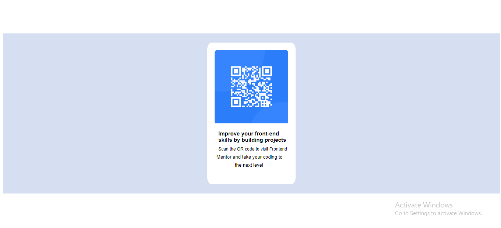

# Frontend Mentor - QR code component solution

This is a solution to the [QR code component challenge on Frontend Mentor](https://www.frontendmentor.io/challenges/qr-code-component-iux_sIO_H). Frontend Mentor challenges help you improve your coding skills by building realistic projects. 

## Table of contents

- [Overview](#overview)
  - [Screenshot](#screenshot)
  - [Links](#links)
  - [Built with](#built-with)
- [Author](#author)

## Overview

### Screenshot

### Links

- Solution URL: [https://adeslim2006.github.io](https://adeslim2006.github.io)
- Live Site URL: [https://adeslim2006.github.io](https://adeslim2006.github.io)

### Built with

- Semantic HTML5 markup
- Flexbox

## Author

- Website - [Salim](https://www.your-site.com)
- Frontend Mentor - [Salim](https://www.frontendmentor.io/profile/adeslim2006)
- Twitter - [Salim](https://www.twitter.com/adeslim2006)

